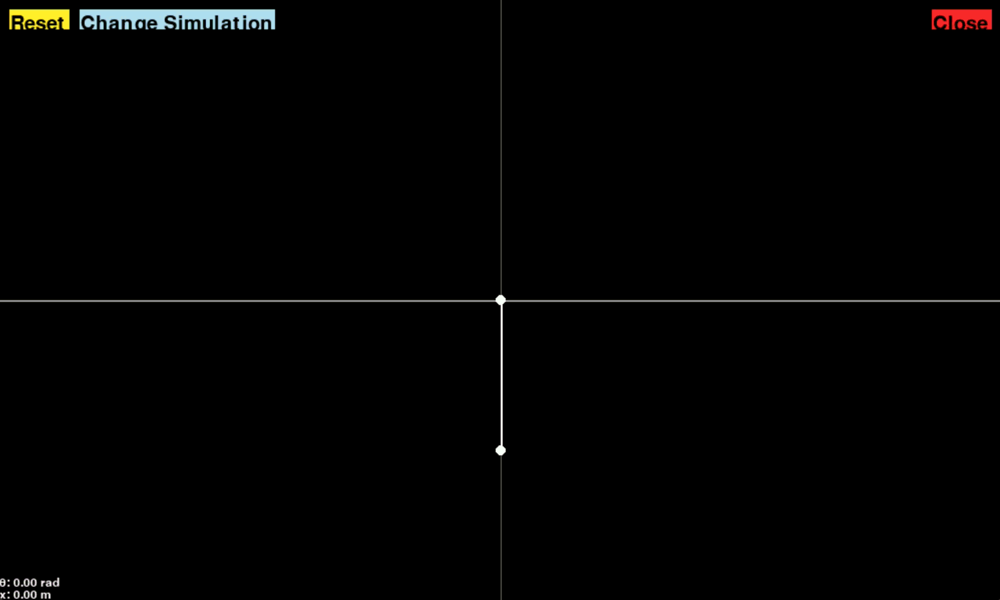

<!-- Improved compatibility of back to top link: See: https://github.com/othneildrew/Best-README-Template/pull/73 -->
<a id="readme-top"></a>

<!-- PROJECT LOGO -->
<div align="center">
<h1 align="center">Pendulum Simulations</h3>

  <p align="left">
    This project consists of Python simulations for a double pendulum system and a sliding single pendulum.
  </p>

  
  
</div>


<!-- ABOUT THE PROJECT -->
## About The Project
This simulation was built as a component of a bigger project for a college course. The project's goal was to balance a real inverted pendulum. This simulation was made to study the behaviors of pendulum systems and numerical methods. More details about the design of this simulation and the overall project can be read <a href="https://drive.google.com/file/d/1Q4_FuzLfHWG0DbmcKPe29qYOvS30eGcJ/view?usp=sharing">here</a>.

<p align="right">(<a href="#readme-top">back to top</a>)</p>


<!-- GETTING STARTED -->
## Installation

To get a local copy up and running follow these simple example steps.

1. Clone the repo
   ```sh
   git clone https://github.com/Beanos06/DoublePendulum.git
   ```
2. Set up a virual environment

    #### Windows Users
    ```sh
    python -m venv venv
    venv\Scripts\activate
    ```

    #### Mac Users
    ```bash
    python3 -m venv venv
    source venv/bin/activate
    ```
3. Install the required libraries
   ```sh
   pip install -r requirements.txt
   ```

<p align="right">(<a href="#readme-top">back to top</a>)</p>


<!-- USAGE EXAMPLES -->
## Usage

Through the command line, head to the `src/` folder and run

```sh
python main.py
```
Here are some details on how to use the application:
- Use the "Change Simulation" button to switch between the simulations
- Use the "Reset" button to reset the current pendulum system to its initial conditions
- Use the "Close" button to close the applicatoin
- For the sliding pendulum, use the left and right arrow keys to slide it sideways


<p align="right">(<a href="#readme-top">back to top</a>)</p>

